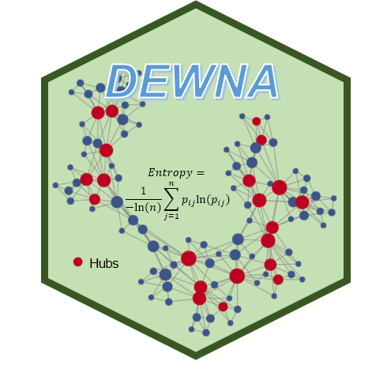
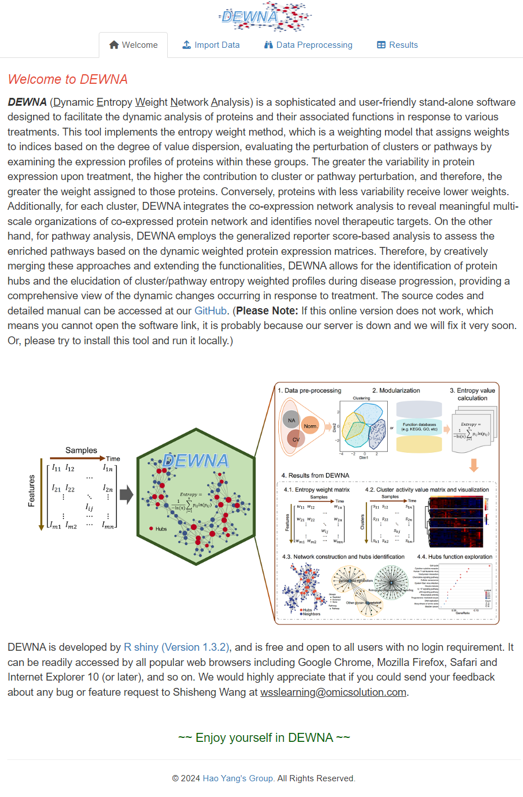

# DEWNA
Dynamic Entropy Weight Network Analysis

## Brief Description
**<font size='5'> DEWNA </font>** (Dynamic Entropy Weight Network Analysis) is a web-based tool, which implements the entropy weight method, which is a weighting model that assigns weights to indices based on the degree of value dispersion, evaluating the perturbation of clusters or pathways by examining the expression profiles of proteins within these groups. The greater the variability in protein expression upon treatment, the higher the contribution to cluster or pathway perturbation, and therefore, the greater the weight assigned to those proteins. Conversely, proteins with less variability receive lower weights. Additionally, for each cluster, DEWNA integrates the co-expression network analysis to reveal meaningful multi-scale organizations of co-expressed protein network and identifies novel therapeutic targets. On the other hand, for pathway analysis, DEWNA employs the generalized reporter score-based analysis to assess the enriched pathways based on the dynamic weighted protein expression matrices. Therefore, by creatively merging these approaches and extending the functionalities, DEWNA allows for the identification of protein hubs and the elucidation of cluster/pathway entropy weighted profiles during disease progression, providing a comprehensive view of the dynamic changes occurring in response to treatment. In addition, this tool supports both online access and local installation. The online version can be linked from here: [https://www.omicsolution.com/wukong/DEWNA](https://www.omicsolution.com/wukong/DEWNA). **Please note**: If the data are too large, we recommend users to intall this tool locally. Local installation can be found below.

## Software Manual
A detailed introduction of this software can be found in [SupplementaryNotes.pdf](https://github.com/wangshisheng/DEWNA/blob/main/SupplementaryNotes.pdf) file.

## Citation
Shisheng Wang, Wenjuan Zeng, Yin Yang, Jingqiu Cheng, Dan Liu, Hao Yang, DEWNA: dynamic entropy weight network analysis and its application to the DNA-binding proteome in A549 cells with cisplatin-induced damage, Briefings in Bioinformatics, Volume 25, Issue 6, November 2024, bbae564, [https://doi.org/10.1093/bib/bbae564](https://doi.org/10.1093/bib/bbae564).

## Preparation for local installation
This tool is developed with R, so if you want to run it locally, you may do some preparatory work: 
**1. Install R.** You can download R from here: [https://www.r-project.org/](https://www.r-project.org/).  
**2. Install RStudio.** (Recommendatory but not necessary). You can download RStudio from here: [https://www.rstudio.com/](https://www.rstudio.com/).  
**3. Check packages.** After installing R and RStudio, you should check whether you have installed these packages (devtools, shiny, shinyjs, shinyBS, shinyWidgets, readxl, gdata, ggplot2, ggsci, DT, data.table, uwot, pheatmap, RColorBrewer, tidyverse, ggExtra, cowplot, writexl, impute, Amelia, qgraph, MEGENA, MetaNet, clusterProfiler, ReporterScore). You may run the codes below to check them:  

```r
if(!require(pacman)) install.packages("pacman")
pacman::p_load(devtools, shiny, shinyjs, shinyBS, shinyWidgets, readxl, gdata, ggplot2, ggsci, DT, data.table, uwot, pheatmap, RColorBrewer, tidyverse, ggExtra, cowplot, writexl, impute, Amelia, qgraph, MEGENA, MetaNet, clusterProfiler, ReporterScore)
```

## Run it locally
If the preparatory work has been done, you can run this tool locally as below:
```r
if(!require(DEWNA)) devtools::install_github("wangshisheng/DEWNA")
library(DEWNA)
DEWNA_app()
```

Then DEWNA will be started as below:




Enjoy yourself^_^


## Friendly suggestion
1. Open DEWNA with Chrome or Firefox.
2. The minimum operating system specifications are: **RAM 8GB, Hard drive 500 GB.**


## Contact
You could push an issue on this github. And optionally, please feel free to sent me an e-mail if you have any question or find a bug about this tool. Thank you^_^
Email: wsslearning@omicsolution.com.


